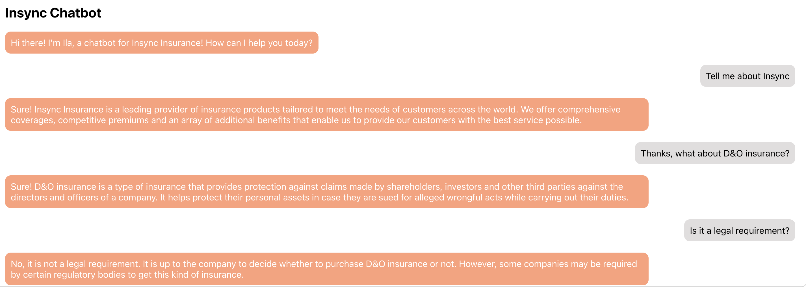
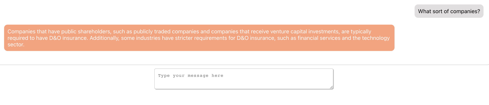
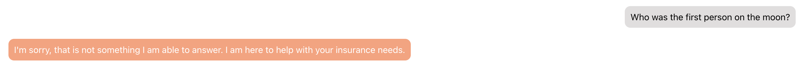

# Insync Chatbot
This is a demo chatbot for Insync Insurance. It is currently trained to answer questions about Insync Insurance and Directors & Officers Insurance.

Below are some example screenshots of questions you can ask the chatbot:

**Note**: The chatbot is currently trained on a very limited dataset. You may find that it does not always answer your questions correctly. However, it is still a good example of how you can use GPT-3 to build a chatbot.

## Basic Questions

## Going off script

## Built With
* OpenAI's GPT-3 API